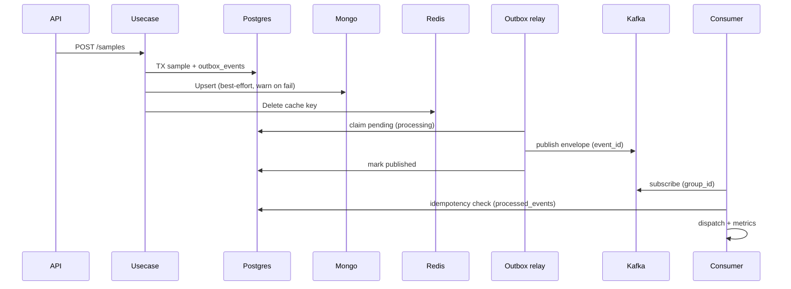

# Clean Architecture Go Template

Template service dengan Clean Architecture + multi-transport (HTTP / gRPC / WebSocket).

## Stack

| Layer | Tech |
|---|---|
| HTTP | chi |
| gRPC | google.golang.org/grpc (+ health.v1) |
| WebSocket | github.com/coder/websocket (successor nhooyr) |
| Postgres | sqlx |
| Cache | Redis |
| Document | MongoDB |
| Messaging | Kafka (segmentio) |
| Logging | slog JSON → Loki-friendly |
| Tracing | OpenTelemetry → Tempo |
| Metrics | Prometheus |
| Migration | Goose |
| Config | Viper |
| DI | Manual bootstrap (per domain) |

## Domain contoh

### 1. Healthcheck
- **HTTP** `/api/v1/health` → Postgres + Redis (public, no API key)
- **gRPC** `healthcheck.v1.HealthcheckService/Check` → upstream gRPC via **grpc.health.v1** (recommended)
- **WebSocket** `/api/v1/ws/health` → MongoDB ping (public)

### 2. Sample CRUD
- HTTP `/api/v1/samples` (protected when `app.secret` is set)
- gRPC `sample.v1.SampleService`
- WebSocket `/api/v1/ws/samples`
- Persist ke Postgres (source of truth + optimistic locking), cache Redis, document Mongo (direct write, warn on failure), event Kafka (transactional outbox)

## Security

When `app.secret` is set to a real value (not `CHANGE_ME` or empty), protected routes require header:

```
X-API-Key: <app.secret>
```

| Route | Auth |
|---|---|
| `/api/v1/health`, `/api/v1/healthz`, `/api/v1/ws/health` | Public |
| `/api/v1/samples`, `/api/v1/ws/samples` | Protected |
| `/metrics` | Protected (same API key) |
| `GET /` | Public |

## Multi-store & messaging patterns

| Store / bus | Role |
|---|---|
| **Postgres** | Source of truth; sample + `outbox_events` in one TX on writes; `version` column for optimistic locking |
| **Mongo** | Demo direct write dari usecase setelah Postgres sukses; failure → `log.Warn` + `mongo_sync_failures_total` |
| **Redis** | Cache-aside on read; invalidate (`Delete`) on write; cache errors logged, tidak fail request |
| **Kafka publish** | Two-phase outbox relay → topic `sample.events` |
| **Kafka consume** | Idempotent consumer (`processed_events`), DLQ topic `sample.events.dlq` untuk poison messages |



**Consumer group:** `kafka.group_id` (default `clean-template`). Semua worker instance dengan group yang sama share partition assignment (rebalance otomatis).

**Run worker (outbox relay + consumer):**

```bash
make run-worker
```

**Replay failed outbox rows:**

```bash
go run ./cmd/outbox-replay
```

## Quick start

```bash
# infra
docker compose -f deployments/docker-compose.yml up -d postgres redis mongo kafka

# migrate + run
make migrate-up
make run-api
```

## Makefile

```bash
make run-api          # go run ./cmd/api
make run-grpc         # gRPC only
make run-worker       # outbox relay + Kafka consumer
make migrate-up
make proto            # generate protobuf
make test-unit
make test-integration # needs DATABASE_URL
make docker-up
make build            # includes bin/outbox-replay
```

## Test strategy

1. **Unit** — usecase dengan mock/in-memory repo (`*_test.go`, `make test-unit`)
2. **Handler** — HTTP handler + chi + testutil
3. **Outbox** — sqlmock unit tests + integration (`DATABASE_URL`)
4. **Integration** — real Postgres (`DATABASE_URL=... make test-integration`)
5. **CI** — GitHub Actions: unit, vet, integration with Postgres service

## Graceful shutdown

`internal/app/lifecycle` menunggu SIGINT/SIGTERM lalu menjalankan shutdown hooks LIFO.

**API:** HTTP → gRPC → APM → clients → Kafka producer → Mongo → Redis → Postgres

**Worker:** outbox relay stop → Kafka consumer close → DLQ producer close → infra hooks

## Documentation

Full English codebase guide (per-layer and per-file): [docs/README.md](docs/README.md)

## Layout

```
cmd/                  entrypoints (api, grpc, worker, migrate, outbox-replay)
internal/app/         bootstrap (manual DI per domain), middleware, router, server, lifecycle
internal/config/      viper config
internal/domain/      healthcheck, sample, ports (telemetry/websocket interfaces)
internal/infrastructure/  persistence, messaging, outbox, telemetry, healthcheck adapters, db, redis, mongo, kafka, logger, apm, metrics, ws, grpc
internal/pkg/         errors, formatter, validator, testutil
internal/proto/       protobuf sources + generated stubs
migrations/           goose (samples, outbox, version, processed_events)
deployments/          compose, nginx, prometheus, tempo
.github/workflows/    CI (unit + integration)
```
