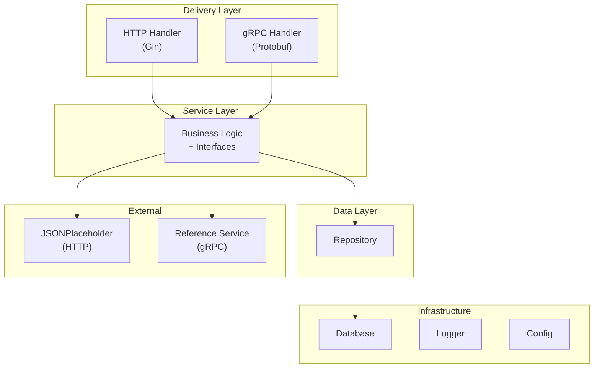

# Clean Template

Template Go dengan clean architecture untuk service yang expose **HTTP (Gin)** dan **gRPC**, dengan contoh consume **external HTTP** dan **external gRPC**.

## Tech Stack

- Go 1.26+
- Gin (HTTP)
- gRPC + Protobuf
- GORM + MySQL
- Logrus

## Arsitektur

Prinsip utama: **dependency mengalir ke dalam**. Layer terluar (HTTP/gRPC) bergantung pada layer dalam (service), bukan sebaliknya.



### Alur request

1. Request masuk via HTTP atau gRPC handler
2. Handler parse request (DTO / Protobuf) → panggil **service**
3. Service jalankan business logic → panggil **repository** atau **external client**
4. Repository akses database via GORM
5. Response di-map kembali ke format transport (JSON / Protobuf)

### Struktur folder

```
clean-template/
├── cmd/
│   ├── server/                 # Entry point aplikasi utama
│   └── reference-server/       # Mock external gRPC (development)
│
├── internal/
│   ├── app/                    # Wiring dependency + lifecycle (graceful shutdown)
│   ├── config/                 # Load konfigurasi dari .env
│   ├── entity/                 # Domain model (core business object)
│   ├── service/                # Business logic + interface repository/external
│   ├── repository/             # Data access (GORM)
│   ├── infrastructure/         # Detail teknis (database, logger)
│   └── delivery/
│       ├── http/
│       │   ├── handler/        # HTTP handlers (concrete struct)
│       │   ├── dto/            # Request/response HTTP
│       │   ├── middleware/     # HTTP middleware
│       │   ├── response/       # Format response JSON
│       │   ├── router.go
│       │   └── server.go
│       └── grpc/
│           ├── handler/        # gRPC handlers (concrete struct)
│           ├── interceptor/    # gRPC interceptor (setara middleware)
│           └── server.go
│
├── external/
│   ├── jsonplaceholder/        # Client external HTTP
│   └── reference/              # Client external gRPC
│
├── proto/
│   ├── sample/v1/              # Kontrak gRPC service ini
│   └── external/v1/            # Kontrak gRPC pihak ketiga
│
├── migrate/                    # Auto-migrate models
├── constants/                  # Pesan response
├── Makefile
└── .env.example
```

### Tanggung jawab tiap layer

| Layer | Package | Tanggung jawab |
|-------|---------|----------------|
| **Entity** | `internal/entity` | Domain model murni. Tidak tahu HTTP/gRPC. |
| **Service** | `internal/service` | Business logic. Interface repo & external didefinisikan di sini (consumer-side). |
| **Repository** | `internal/repository` | Akses database. Implementasi interface dari service. |
| **Delivery** | `internal/delivery/*` | Adapter transport. Parse request, panggil service, format response. |
| **External** | `external/*` | Client ke service pihak ketiga (HTTP/gRPC). |
| **Infrastructure** | `internal/infrastructure` | Database connection, logger. |
| **App** | `internal/app` | Dependency injection (`wire.go`) + graceful shutdown. |

### Keputusan desain

**Entity vs DTO — dipisah**

- `internal/entity` → domain model (`Sample`), dipakai service & repository
- `internal/delivery/http/dto` → request/response HTTP (`SampleRequest`, `SampleResponse`)
- `proto/sample/v1` → message gRPC

Entity tidak boleh punya tag `form:` atau `binding:` — itu concern transport.

**Interface di service, bukan di handler**

- `SampleRepository`, `ExternalHTTPClient`, `ExternalGRPCClient` → didefinisikan di `internal/service`
- Handler pakai **concrete struct**, tidak perlu interface
- HTTP dan gRPC share **service yang sama**

**Tidak ada global state**

Config, logger, dan database di-inject via constructor di `internal/app/wire.go`.

## Prerequisites

- Go 1.26+
- MySQL
- `protoc` (untuk generate gRPC code)

Install protoc plugins (sekali saja):

```bash
go install google.golang.org/protobuf/cmd/protoc-gen-go@latest
go install google.golang.org/grpc/cmd/protoc-gen-go-grpc@latest
```

## Setup Lokal

### 1. Clone & install dependency

```bash
git clone <repo-url>
cd clean-template
go mod download
```

### 2. Konfigurasi environment

```bash
cp .env.example .env
```

Edit `.env` sesuai environment kamu:

```env
APP_NAME="clean-template"
PORT=8080
GRPC_PORT=7000

DB_HOST=127.0.0.1
DB_PORT=3306
DB_NAME=clean_template
DB_USER=root
DB_PASSWORD=password

EXTERNAL_API_URL=https://jsonplaceholder.typicode.com
EXTERNAL_GRPC_ADDR=localhost:7001
```

### 3. Siapkan database

Buat database MySQL sesuai `DB_NAME` di `.env`. Migration berjalan otomatis saat server start.

### 4. Generate protobuf (jika .proto berubah)

```bash
make proto
```

## Menjalankan Server

Butuh **2 terminal** karena app consume external gRPC.

**Terminal 1 — mock external gRPC server:**

```bash
make run-reference
# listening on :7001
```

**Terminal 2 — aplikasi utama:**

```bash
make run
# HTTP  → :8080
# gRPC  → :7000
```

Atau build binary dulu:

```bash
make build
./bin/reference-server   # terminal 1
./bin/server             # terminal 2
```

## API Endpoints

### HTTP

| Method | Path | Deskripsi |
|--------|------|-----------|
| GET | `/health` | Healthcheck (cek external HTTP + gRPC) |
| GET | `/sample/v1/list?page=1&limit=10` | List sample |
| GET | `/sample/v1/get/:id` | Get sample by ID |
| POST | `/sample/v1/create` | Create sample |
| PUT | `/sample/v1/update/:id` | Update sample |
| DELETE | `/sample/v1/delete/:id` | Delete sample |

**Contoh:**

```bash
# healthcheck
curl http://localhost:8080/health

# list
curl "http://localhost:8080/sample/v1/list?page=1&limit=10"

# create
curl -X POST http://localhost:8080/sample/v1/create \
  -H "Content-Type: application/json" \
  -d '{"name": "sample satu"}'

# get (name di-enrich dari external gRPC)
curl http://localhost:8080/sample/v1/get/1

# update
curl -X PUT http://localhost:8080/sample/v1/update/1 \
  -H "Content-Type: application/json" \
  -d '{"name": "sample updated"}'

# delete
curl -X DELETE http://localhost:8080/sample/v1/delete/1
```

### gRPC

Service: `sample.v1.SampleService` — port `7000`

```bash
# list
grpcurl -plaintext -d '{"page":1,"limit":10}' \
  localhost:7000 sample.v1.SampleService/ListSample

# get
grpcurl -plaintext -d '{"id":1}' \
  localhost:7000 sample.v1.SampleService/GetSample

# create
grpcurl -plaintext -d '{"name":"foo"}' \
  localhost:7000 sample.v1.SampleService/CreateSample

# update
grpcurl -plaintext -d '{"id":1,"name":"bar"}' \
  localhost:7000 sample.v1.SampleService/UpdateSample

# delete
grpcurl -plaintext -d '{"id":1}' \
  localhost:7000 sample.v1.SampleService/DeleteSample
```

> Butuh [grpcurl](https://github.com/fullstorydev/grpcurl) terinstall untuk test gRPC dari CLI.

## Makefile Commands

| Command | Deskripsi |
|---------|-----------|
| `make proto` | Generate Go code dari file `.proto` |
| `make run` | Jalankan server utama |
| `make run-reference` | Jalankan mock external gRPC server |
| `make build` | Build binary ke `bin/server` dan `bin/reference-server` |

## Menambah Fitur Baru

1. Buat entity di `internal/entity/`
2. Tambah interface + logic di `internal/service/`
3. Implementasi repository di `internal/repository/`
4. Buat HTTP handler + DTO di `internal/delivery/http/`
5. (Opsional) Buat proto + gRPC handler di `proto/` dan `internal/delivery/grpc/`
6. Register dependency di `internal/app/wire.go`
7. Register route di `internal/delivery/http/router.go`

## License

MIT
