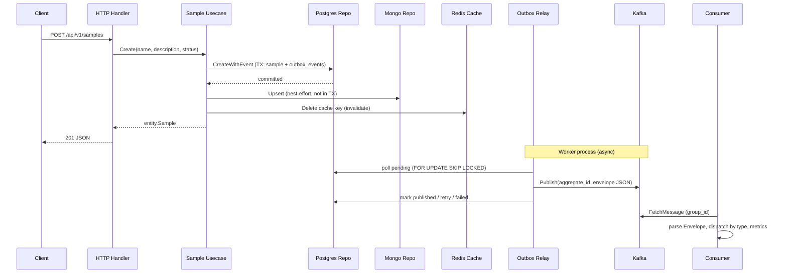

# Architecture Overview

## Layer diagram

```
cmd/           entrypoints (api, grpc, worker, migrate)
  ↓
internal/app/  bootstrap (manual DI), router, server, middleware, lifecycle
  ↓
internal/domain/   entities, ports, usecases, handlers, transport registration
  ↓
internal/infrastructure/   adapters: persistence, messaging, clients, observability
```

Each **domain** (e.g. `sample`, `healthcheck`) owns its business logic. Infrastructure implements domain ports. Application code wires everything together at startup.

## Dependency rule

**Domain never imports infrastructure.**

- Ports live in `internal/domain/<name>/interfaces.go` (or checker-specific ports in healthcheck).
- Adapters live in `internal/infrastructure/**`.
- `internal/app/bootstrap` is the composition root: it constructs concrete adapters and injects them into usecases and handlers.

Violating this rule (e.g. importing `sqlx` in a usecase) couples business logic to a specific database and breaks testability.

## Manual dependency injection

There is no Wire, Fx, or code-generated DI. Each domain has a `wire*` function in `internal/app/bootstrap/`:

- `wireInfra` — shared clients (Postgres, Redis, Mongo, Kafka producer, gRPC client, WebSocket hub, APM, logger)
- `wireSample` — repo → usecase → HTTP/gRPC/WS handlers
- `wireHealthcheck` — ping adapters → usecase → handlers
- `WireWorker` — outbox relay + Kafka consumer (worker process only)

The `Container` struct groups domain modules so `bootstrap.go` stays small as new domains are added.

## Multi-transport pattern

Every domain follows the same shape:

```
transport (route registration)
    → handler (protocol-specific: decode/encode, validation)
        → usecase (business logic)
            → repository / checker ports (interfaces)
                → infrastructure adapters
```

| Transport | Sample routes | Healthcheck routes |
|-----------|---------------|-------------------|
| HTTP | `/api/v1/samples` | `/api/v1/health`, `/api/v1/healthz` |
| gRPC | `sample.v1.SampleService` | `healthcheck.v1.HealthcheckService` |
| WebSocket | `/api/v1/ws/samples` | `/api/v1/ws/health` |

Handlers are thin; usecases are shared across transports.

## Sample CRUD data flow

Multi-store write on create/update/delete; cache-aside on read. Kafka publish is **not** direct from the usecase — events go through the transactional outbox.



See [ADR 001](adr/001-transactional-outbox.md) for publish reliability rationale.

## Worker process

`cmd/worker` runs two background goroutines:

1. **Outbox relay** — polls `outbox_events`, publishes to Kafka topic `sample.events` (config: `kafka.topic`)
2. **Kafka consumer** — subscribes with `kafka.group_id`, parses `event.Envelope`, logs and records metrics

Consumer group members share partition assignment; scale workers horizontally with the same `group_id`.

## Graceful shutdown

`internal/app/lifecycle.Manager` waits for `SIGINT` or `SIGTERM`, then runs shutdown hooks **LIFO** (last registered runs first) within `http.shutdown_timeout`.

Typical order for `cmd/api` (after hooks registered in main + bootstrap):

1. gRPC `GracefulStop`
2. HTTP `Shutdown`
3. APM tracer shutdown
4. External gRPC client close
5. Postgres pool close
6. Redis close
7. Mongo disconnect
8. Kafka producer close

Worker additionally closes the Kafka consumer before infra hooks.

## SOLID in this codebase

| Principle | Example |
|-----------|---------|
| **S** — Single responsibility | `PostgresRepository` only handles SQL; `SampleUsecase` only orchestrates business rules |
| **O** — Open/closed | New storage backend: implement `sample.Repository` without changing usecase |
| **L** — Liskov substitution | `PostgresPing`, `RedisPing`, etc. satisfy `healthcheck.PostgresChecker` / `RedisChecker` ports |
| **I** — Interface segregation | `CacheRepository` and `DocumentRepository` are separate from `Repository` |
| **D** — Dependency inversion | Usecase depends on `sample.Repository` interface; bootstrap injects `PostgresRepository` |

## Cross-links

- [Sample usecase](layers/domain-sample.md#internaldomainsampleusecaseusecasego) — business logic and multi-store orchestration
- [Postgres repository](layers/infrastructure.md#internalinfrastructurepersistencesamplepostgresgo) — transactional outbox writes
- [Outbox relay](layers/infrastructure.md#internalinfrastructureoutboxrelaygo) — poll and publish
- [ADR 001: Transactional Outbox](adr/001-transactional-outbox.md)
